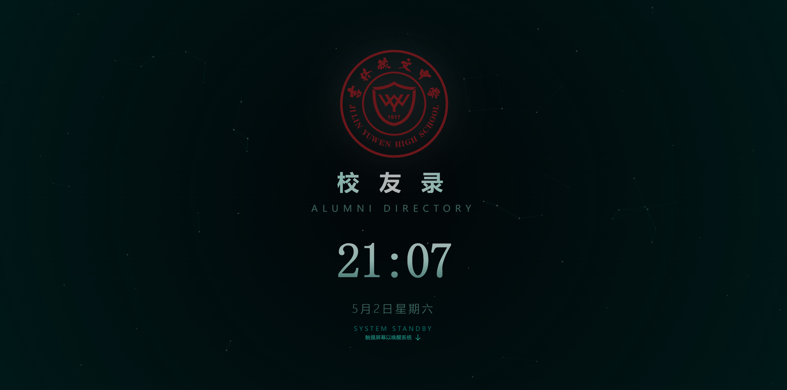
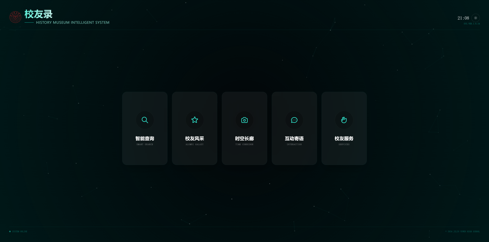
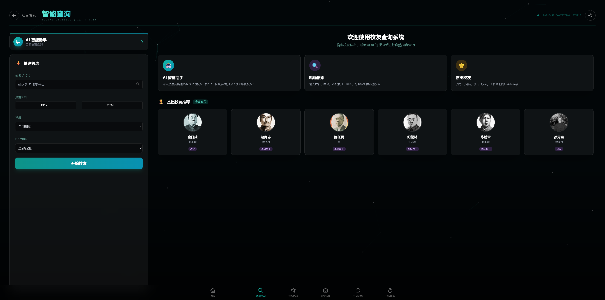
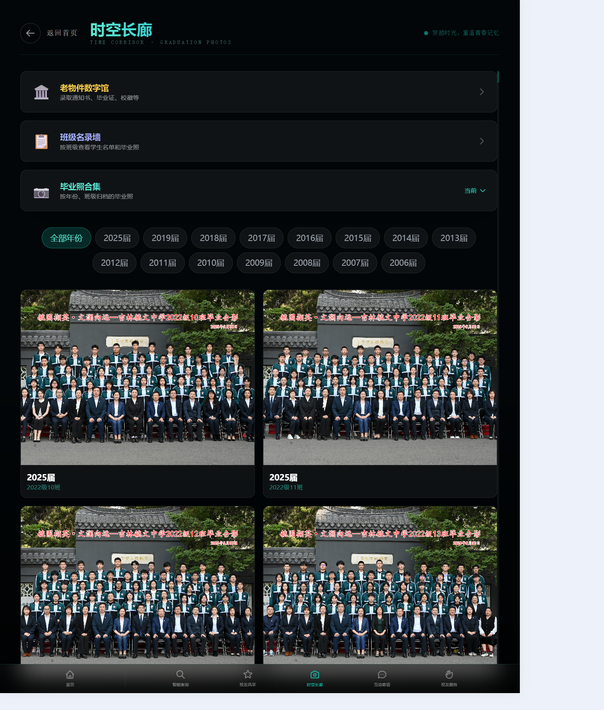
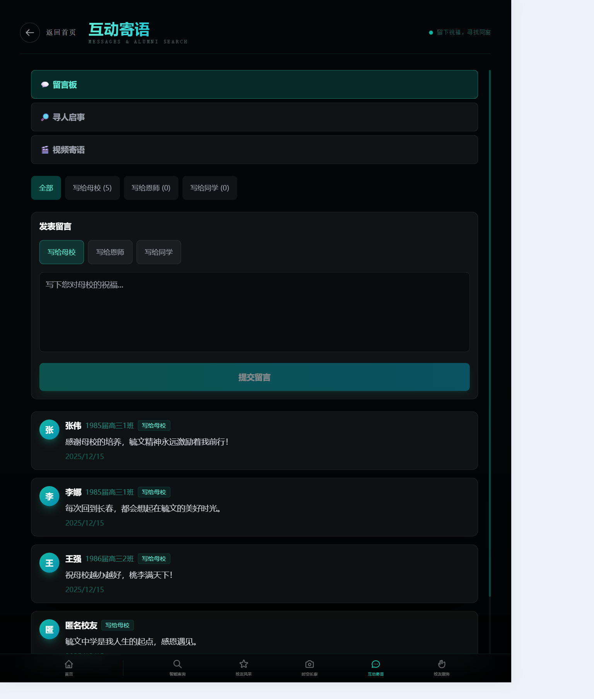
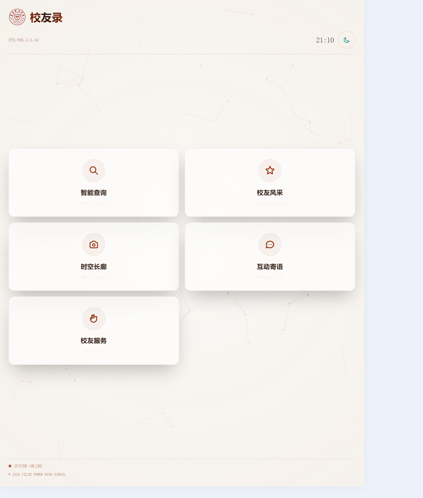

<div align="center">

<!-- Banner -->


<br/>

<h1>
  
  AlumNet
</h1>

**AI-Powered School History Exhibition & Alumni Management System**

**AI 智能校史展示系统 — 校友星图**

<p>
  <em>The first open-source AI-powered alumni exhibition system designed for school history museums.</em>
</p>

<p>
  <a href="https://github.com/jungang/alumnet/stargazers">
    
  </a>
  <a href="https://github.com/jungang/alumnet/blob/main/LICENSE">
    
  </a>
  
  
  <br/>
  
  
  
  
  
  
</p>

<h4>
  <a href="#-quick-start">Quick Start</a> ·
  <a href="#-screenshots">Screenshots</a> ·
  <a href="#-features">Features</a> ·
  <a href="#-architecture">Architecture</a> ·
  <a href="#-deployment">Deployment</a> ·
  <a href="https://github.com/jungang/alumnet/issues">Issues</a> ·
  <a href="./CONTRIBUTING.md">Contributing</a>
</h4>

</div>

---

> **🌟 Highlight**: AlumNet combines an immersive Three.js-powered exhibition kiosk with AI-driven natural language search (RAG), creating a museum-grade interactive experience that any school can deploy in 30 minutes with Docker.

---

## 💡 What is AlumNet?

AlumNet is a full-stack open-source system purpose-built for **school history museums and alumni associations**. It provides:

- 🖥️ A **touch-screen kiosk** with sci-fi visual effects — alumni galaxies, time corridors, vintage museums
- 🤖 **AI-powered natural language search** — ask "哪些校友在医疗领域工作？" and get intelligent answers via RAG
- ⚙️ A **complete admin dashboard** — manage alumni data, photos, messages, donations, and more
- 🐳 **One-command Docker deployment** — production-ready out of the box

Built for schools, museums, and education developers. Deploy it for your alma mater today.

---

## 📸 Screenshots

<table>
  <tr>
    <td width="50%">
      
      <p align="center"><b>✨ Standby Screen</b><br/><sub>Sci-fi style kiosk standby with real-time clock</sub></p>
    </td>
    <td width="50%">
      
      <p align="center"><b>🧭 Main Navigation</b><br/><sub>Five core modules with dark futuristic UI</sub></p>
    </td>
  </tr>
  <tr>
    <td width="50%">
      
      <p align="center"><b>🤖 AI Smart Search</b><br/><sub>Natural language query powered by RAG</sub></p>
    </td>
    <td width="50%">
      
      <p align="center"><b>⏳ Time Corridor</b><br/><sub>Chronological photo gallery by graduation year</sub></p>
    </td>
  </tr>
  <tr>
    <td width="50%">
      
      <p align="center"><b>💬 Interactive Message Board</b><br/><sub>Alumni greetings and memories wall</sub></p>
    </td>
    <td width="50%">
      
      <p align="center"><b>🌗 Light Theme</b><br/><sub>Switchable dark/light themes for different venues</sub></p>
    </td>
  </tr>
</table>

---

## ✨ Features

<table>
<tr>
<td width="50%">

### 🖥️ Touch-screen Exhibition Kiosk
Immersive frontend built with **Vue 3 + Three.js**
- **Alumni Galaxy** — 3D interactive star map of alumni
- **Time Corridor** — Chronological photo gallery
- **Vintage Museum** — Digital archive of historical items
- **Top Scholars** — Honor wall for outstanding alumni
- Standby screen with real-time clock & wake-on-touch

</td>
<td width="50%">

### 🤖 AI-Powered Smart Search
Natural language query powered by **RAG architecture**
- Ask questions like "Who graduated in 1990 and works in tech?"
- Context-aware answers with referenced alumni profiles
- Multi-provider support: GLM-4, DeepSeek, or any OpenAI-compatible API
- Powered by **Qdrant** vector database + **pgvector** embeddings

</td>
</tr>
<tr>
<td width="50%">

### ⚙️ Admin Dashboard
Complete management backend with **Element Plus**
- Alumni CRUD, batch import/export (Excel supported)
- Graduation photo management with face tagging
- Content moderation for messages & comments
- System dashboard with usage analytics
- One-click database backup & restore

</td>
<td width="50%">

### 🏗️ Production-Ready Infrastructure
Enterprise-grade deployment out of the box
- **Docker Compose** — One command to production
- **PM2** — Process management with auto-restart
- **Nginx** — Reverse proxy with SPA routing
- **PostgreSQL** — Reliable data storage with pgvector
- Configurable school name, logo, and branding

</td>
</tr>
</table>

---

## 🏛️ Architecture

```
┌─────────────────────────────────────────────────────────────┐
│                        Nginx (Reverse Proxy)                 │
├──────────────┬──────────────┬───────────────────────────────┤
│              │              │                               │
│  ┌─────────┐ │ ┌──────────┐ │  ┌──────────────────────────┐ │
│  │  Client  │ │ │  Admin   │ │  │       Server (API)       │ │
│  │ (Kiosk)  │ │ │ (Manage) │ │  │      Express + TS       │ │
│  │          │ │ │          │ │  │                          │ │
│  │ Vue 3    │ │ │ Vue 3    │ │  │  ┌──────┐  ┌─────────┐ │ │
│  │ Three.js │ │ │ Element  │ │  │  │ Auth │  │   RAG   │ │ │
│  │ Tailwind │ │ │ Plus     │ │  │  └──────┘  └─────────┘ │ │
│  └─────────┘ │ └──────────┘ │  │  ┌──────┐  ┌─────────┐ │ │
│              │              │ │  │ Alumni│  │ Backup  │ │ │
│  Port 5173   │  Port 5174   │ │  └──────┘  └─────────┘ │ │
│              │              │ │             │  │         │ │
└──────────────┴──────────────┘ │  ┌──────┐  ┌─────────┐ │ │
                                │  │  PG  │  │ Qdrant  │ │ │
                                │  └──────┘  └─────────┘ │ │
                                └──────────────────────────┘ │
                                             Port 3000       │
                                             ────────────────┘
```

---

## 🛠️ Tech Stack

| Layer | Technology | Purpose |
|:------|:-----------|:--------|
| **Kiosk Frontend** | Vue 3 · TypeScript · Three.js · Tailwind CSS | Touch-screen exhibition with 3D visual effects |
| **Admin Dashboard** | Vue 3 · TypeScript · Element Plus · XLSX | Alumni data management & system administration |
| **Backend API** | Node.js · Express · TypeScript | RESTful API with JWT authentication |
| **Database** | PostgreSQL · pgvector | Relational data + vector embeddings |
| **Vector Search** | Qdrant | High-performance similarity search for RAG |
| **AI Engine** | GLM-4 · DeepSeek API | LLM-powered natural language Q&A |
| **Deployment** | Docker · PM2 · Nginx | Production-grade containerized deployment |

---

## 🚀 Quick Start

### Prerequisites

| Requirement | Version | Required? |
|:------------|:--------|:----------|
| Node.js | ≥ 18 | ✅ Yes |
| pnpm | ≥ 8 | ✅ Yes |
| PostgreSQL | ≥ 14 | ✅ Yes (with pgvector recommended) |
| Qdrant | latest | ⭕ Optional (for AI search) |
| AI API Key | — | ⭕ Optional (GLM-4 or DeepSeek) |

### Installation

```bash
# 1️⃣ Clone the repository
git clone https://github.com/jungang/alumnet.git
cd alumnet

# 2️⃣ Install dependencies
pnpm install

# 3️⃣ Configure environment
cp server/.env.example server/.env
# Edit server/.env with your settings

# 4️⃣ Initialize database
# Execute server/src/db/init.sql in PostgreSQL
# (Optional) Execute server/src/db/seed.sql for sample data

# 5️⃣ Start development servers
pnpm dev:server    # Backend API → http://localhost:3000
pnpm dev:client    # Kiosk frontend → http://localhost:5173
pnpm dev:admin     # Admin dashboard → http://localhost:5174
```

### Key Configuration

| Variable | Description | Default |
|:---------|:------------|:--------|
| `SCHOOL_NAME` | School name displayed in UI | `示例中学` |
| `SCHOOL_LOGO_URL` | Path to school logo | `/logo.png` |
| `SCHOOL_SINCE` | School founding year | `1917` |
| `DB_*` | PostgreSQL connection | — |
| `AI_PROVIDER` | AI provider (`glm` or `deepseek`) | `glm` |
| `SCREEN_RESOLUTION` | Target kiosk resolution | `1920x1080` |

---

## 🐳 Deployment

### Docker (Recommended for Production)

```bash
# Configure environment
cp server/.env.example server/.env
# Edit .env with production values...

# Launch all services
docker compose up -d
```

### PM2 (Bare Metal)

```bash
pnpm build:server && pnpm build:client && pnpm build:admin
pnpm pm2:start    # Start all services via PM2
pnpm pm2:status   # Check status
pnpm pm2:logs     # View logs
```

📖 See [DEPLOYMENT.md](./DEPLOYMENT.md) for detailed deployment guide.

---

## 📁 Project Structure

```
alumnet/
├── client/                  # 🖥️ Touch-screen exhibition kiosk
│   └── src/
│       ├── views/           # Galaxy · TimeCorridor · Search · Messages
│       ├── components/      # AIChatDialog · FaceTagOverlay · ThemeToggle
│       └── composables/     # useAutoRefresh · useIdleDetection
├── admin/                   # ⚙️ Management dashboard
│   └── src/
│       ├── views/           # 19 views: Alumni · Photos · Backup · Dashboard...
│       └── api/             # Typed API client
├── server/                  # 🔌 Backend API service
│   └── src/
│       ├── routes/          # REST API endpoints
│       ├── services/        # Business logic (RAG · Auth · Backup)
│       ├── repositories/    # Data access layer
│       └── db/              # Migrations · Seeds · Import scripts
├── .github/                 # 🤖 CI/CD · Issue templates · PR templates
├── docker-compose.yml       # 🐳 Production Docker config
├── deploy.sh                # 📦 Automated deployment script
└── ecosystem.config.js      # ⚡ PM2 process manager
```

---

## 🗺️ Roadmap

- [ ] **i18n** — Multi-language UI support
- [ ] **WeChat Integration** — Login via WeChat mini-program
- [ ] **Photo AI** — Auto face recognition for graduation photos
- [ ] **Data Visualization** — Interactive alumni statistics dashboard
- [ ] **Mobile App** — Responsive design for mobile browsers
- [ ] **Plugin System** — Extensible module architecture

---

## 🤝 Contributing

We welcome contributions from the community! Whether it's a bug fix, new feature, or documentation improvement.

```bash
# Quick contribution workflow
git checkout -b feature/your-feature
git commit -m "feat: add your feature"
git push origin feature/your-feature
# Then open a Pull Request 🎉
```

📖 See [CONTRIBUTING.md](./CONTRIBUTING.md) for detailed guidelines.

**Commit Convention**: We follow [Conventional Commits](https://www.conventionalcommits.org/) — `feat:`, `fix:`, `docs:`, `refactor:`, etc.

---

## 📊 Project Stats

<p align="center">
  
  
  
  
  
</p>

---

## 📄 License

This project is licensed under the **MIT License** — see [LICENSE](./LICENSE) for details.

Free for personal, educational, and commercial use. Attribution appreciated but not required.

---

## ⚠️ Disclaimer

All alumni data included in this project is **fictional** and for **demonstration purposes only**. Do not use the sample data in production environments.

---

<div align="center">

**Made with ❤️ for school history museums everywhere**

[⬆ Back to Top](#-what-is-alumnet)

</div>
